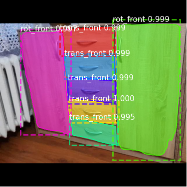
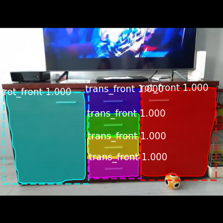

# ros_front_detection_segmentation
<p align="center">
  
&nbsp; &nbsp; &nbsp; &nbsp;
  
</p>

The goal of the project is to build a ROS node that would be responsible for detecting rotational fronts and transitional fronts and then perform a segmentation of the fronts. The module is based on [matterport's Mask RCNN](https://github.com/matterport/Mask_RCNN) implementation. The data used for training, evaluation and testing is available [here](https://drive.google.com/file/d/1R2sqTkDTRU3TJxO2e4iExkFlJHKl8tFf/view?usp=sharing):

 This module is part of my master thesis "Point cloud-based model of the scene enhanced with information about articulated
objects" and works best with the other three modules that can be found here:
- [Handler detector](https://github.com/arekmula/ros_handler_detector)
- [Rotational joint detector](https://github.com/arekmula/ros_joint_segmentation)
- [Articulated objects scene builder](https://github.com/arekmula/articulated_objects_scene_builder)


The node utilizes conda virtual environment to separate the environment variables such as Tensorflow version or
CUDA version.
## Results

### Detection
- mAP@IoU=.50 -> **0.77**
- mAP@IoU=.75 -> **0.71**
- mAP@IoU=.90 -> **0.38**

### Segmentation
- Dice score of rotational fronts -> **0.82**
- Dice score of transitional fronts -> **0.77** 

## Dependencies
- Ubuntu 20.04
- ROS Noetic
- Anaconda

## Installation
- Create conda environment from environment.yml file `conda env create -f environment.yml`
- Activate environment `conda activate ros_mask_rcnn`
- Create catkin workspace with Python executable set from conda:
```
source /opt/ros/noetic/setup.bash
mkdir -p caktin_ws/src
cd catkin_ws
catkin_make -DPYTHON_EXECUTABLE=~/anaconda3/envs/ros_mask_rcnn/bin/python3.6
```
- Clone the repository
```
source devel/setup.bash
cd src
git clone https://github.com/arekmula/ros_front_detection_segmentation
cd ~/catkin_ws
catkin_make
```


## Run with

From activated conda environment run following commands (**remember to source ROS base and devel environment**):
- Setup ROS parameters:
```
rosparam set rgb_image_topic "image/topic"
rosparam set mrcnn_model_dir "path/to/model/mask_rcnn_model.h5"
rosparam set front_prediction_topic "topic/to/publish/prediction"
rosparam set visualize_front_prediction True/False
```

- Run with
```
rosrun front_detection_segmentation front_detection_segmentation_node.py 
```
